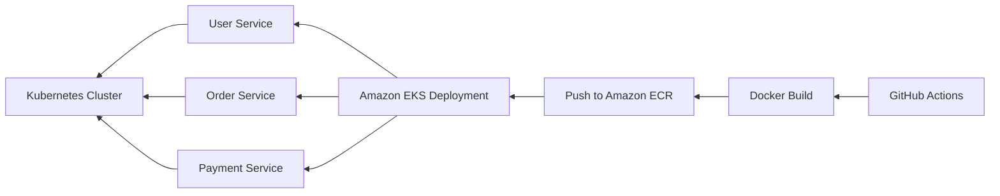

# **Microservices CI/CD Pipeline**

This project demonstrates the use of **GitHub Actions** for a **CI/CD pipeline** to automate the building, pushing, and deployment of Docker images to **Amazon Elastic Container Registry (ECR)**, followed by deployment to **Amazon Elastic Kubernetes Service (EKS)**. The pipeline handles three services: **User Service**, **Order Service**, and **Payment Service**.

## **Overview**

This project provides a fully automated pipeline for:

- **Dockerizing the services.**
- **Pushing Docker images to Amazon ECR.**
- **Deploying to Amazon EKS using Kubernetes.**

## Architecture Diagram



The entire pipeline is triggered on every push to the `master` branch, ensuring the latest code is automatically built, tested, and deployed.

## **Technologies Used**

- **GitHub Actions**: Automates the CI/CD pipeline.
- **Docker**: Containerizes microservices.
- **Amazon ECR**: Hosts Docker images in a private repository.
- **Amazon EKS**: Deploys the services to a Kubernetes cluster.
- **Kubernetes**: Manages deployments on EKS.

## **Setup and Configuration**

## File Structure

```bash
├── .github/
│   └── workflows/
│       └── ci-cd.yml     # GitHub Actions workflow file
├── microservices-project/
│   ├── user-service/
│   │   └── Dockerfile
│   ├── order-service/
│   │   └── Dockerfile
│   └── payment-service/
│       └── Dockerfile
├── k8s/
│   ├── user-deployment.yaml
│   ├── order-deployment.yaml
│   └── payment-deployment.yaml
└── README.md
```

## Example Code
Here are the basic main.py files for each service (User, Order, and Payment) to demonstrate the microservices' entry points.

/user-service/main.py

```python

from flask import Flask, jsonify

app = Flask(__name__)

@app.route('/')
def home():
    return jsonify({"message": "User Service is running!"})

if __name__ == "__main__":
    app.run(host="0.0.0.0", port=5000)
```

## Example Dockerfile
Here is an example of a Dockerfile for one of the services (User Service):

# dockerfile

```python
# Use Python 3.8 as the base image
FROM python:3.8-slim

# Set working directory
WORKDIR /app

# Copy the requirements and install dependencies
COPY requirements.txt 
RUN pip install -r requirements.txt

# Copy the source code
COPY . .

# Expose the port the app will run on
EXPOSE 5000

# Run the application
CMD ["python", "main.py"] 
```

Here’s an example Kubernetes deployment file (user-deployment.yaml) for one of the services:

```yaml
apiVersion: apps/v1
kind: Deployment
metadata:
  name: user-service
spec:
  replicas: 2
  selector:
    matchLabels:
      app: user-service
  template:
    metadata:
      labels:
        app: user-service
    spec:
      containers:
        - name: user-service
          image: 717279687729.dkr.ecr.us-east-1.amazonaws.com/user-service:latest
          ports:
            - containerPort: 5000
---
apiVersion: v1
kind: Service
metadata:
  name: user-service
spec:
  selector:
    app: user-service
  ports:
    - protocol: TCP
      port: 80
      targetPort: 5000
  type: LoadBalancer 
```

## How to Contribute
- **Fork the repository**: 
- **Create a feature branch (`git checkout -b feature-name`)**
- **Make your changes.**
- **Push to the branch (`git push origin feature-name`).**
- **Create a new Pull Request.**


## License
This project is licensed under the MIT License - see the LICENSE file for details.


